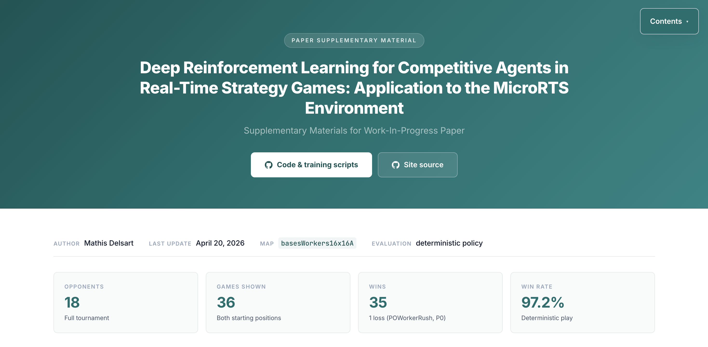
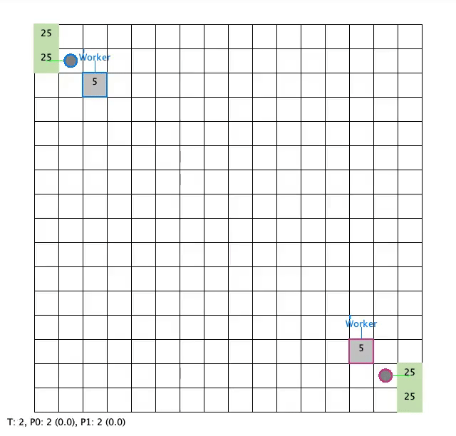
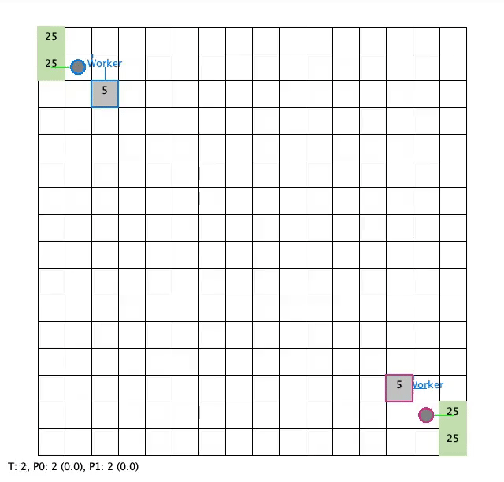

# Deep Reinforcement Learning for Competitive Agents in Real-Time Strategy Games

> **Application to the MicroRTS Environment** — Supplementary materials website for a Work-in-Progress paper by [Mathis Delsart](https://github.com/mathisdelsart).

This repository hosts the source of a Jekyll-based GitHub Pages site that collects **reproducible evidence** behind the tournament results reported in the paper: game recordings, head-to-head matrices, and game-theoretic rankings (Nash, Alpha-Rank, Copeland, robustness) for a deep RL agent trained and evaluated on the single-map `basesWorkers16x16A` MicroRTS setting.

**Live site:** [mathisdelsart.github.io/microrts-rl-single-map](https://mathisdelsart.github.io/microrts-rl-single-map/)  
**Training code:** [mathisdelsart/MasterThesis](https://github.com/mathisdelsart/MasterThesis)

---



## Overview

The site is organised into three sections that mirror the paper's evaluation protocol:

1. **Tournament summary** — overall standings and head-to-head win-rate matrix for the final 19-agent round-robin tournament.
2. **Example games** — one GIF per starting position (P0 / P1) against each opponent, all played with a deterministic policy.
3. **Detailed analysis** — game-theoretic metrics (Copeland scores, Alpha-Rank sweep, Nash averaging, robustness) that complement the raw win rates.

### Headline results

| Metric | Value |
| :--- | :--- |
| Opponents in final tournament | **18** |
| Games shown on the page | **36** (both starting positions) |
| Wins | **35** |
| Win rate (deterministic play) | **97.2 %** |
| Map | `basesWorkers16x16A` (16×16) |

The single loss occurs against `POWorkerRush` when the agent starts in position P0.

---

## Example matches

<table>
  <tr>
    <th width="50%">vs <strong>RAISocketAI</strong></th>
    <th width="50%">vs <strong>TMA</strong></th>
  </tr>
  <tr>
    <td align="center"></td>
    <td align="center"></td>
  </tr>
  <tr>
    <td align="center">Our agent starts in P0 — <strong>Win</strong></td>
    <td align="center">Our agent starts in P0 — <strong>Win</strong></td>
  </tr>
</table>

All 36 recordings and their starting-position variants are available on the [live site](https://mathisdelsart.github.io/microrts-rl-single-map/#example-games).

---

## Repository structure

```
.
├── _config.yml          # Jekyll configuration (Cayman theme)
├── _layouts/
│   └── default.html     # Page shell (header, navigation, footer)
├── index.md             # Main page content and styles
├── figures/             # Static tournament figures (PNG)
│   ├── final_standings.png
│   ├── h2h_matrix.png
│   ├── copeland_scores.png
│   ├── alpha_rank_sweep.png
│   ├── nash_scores.png
│   └── robustness_score.png
├── videos/              # One GIF per (opponent, starting position)
│   └── BestRL-350M_vs_<Opponent>_P{0,1}.gif
├── screenshots/         # Page screenshots used in this README
├── sync_videos.sh       # Helper to refresh GIFs from the training repo
├── Gemfile              # Ruby dependencies (github-pages gem)
├── Gemfile.lock         # Locked gem versions (generated by `bundle install`)
├── .ruby-version        # Ruby version pin (for rbenv / chruby)
├── .gitignore
├── LICENSE              # MIT License
└── README.md
```

---

## Local development

The site uses the default GitHub Pages Jekyll build (Cayman theme). To preview it locally:

```bash
# 1. Install Ruby dependencies (uses the version pinned in .ruby-version)
bundle install

# 2. Serve the site with live reload
bundle exec jekyll serve --livereload

# 3. Open http://127.0.0.1:4000
```

### Refreshing media assets

- `figures/` — regenerated from the analysis scripts in [mathisdelsart/MasterThesis](https://github.com/mathisdelsart/MasterThesis).
- `videos/` — can be re-synced from a local training output directory with `./sync_videos.sh` (edit the paths at the top of the script first).

---

## Citation

If you use these materials, please cite the Work-in-Progress paper. A full BibTeX entry will be added here once the preprint is available.

## Author

**Mathis Delsart** — Master's thesis on applied deep reinforcement learning for real-time strategy games.

Questions, feedback, or collaboration inquiries are welcome via GitHub issues or direct contact.

- [GitHub profile](https://github.com/mathisdelsart)
- [Training & research repository](https://github.com/mathisdelsart/MasterThesis)

## License

The source code of this site (layouts, configuration, scripts) is released under the [MIT License](LICENSE).
Game recordings, figures, and tournament data are shared for academic review and reproducibility, and remain the intellectual property of the author; please cite the accompanying paper if you reuse them.
