

  
Author Mathis Delsart

  
Last update April 20, 2026

  
Map <code>basesWorkers16x16A</code>

  
Evaluation deterministic policy

  

    
Opponents

    
18

    
Full tournament

  

  

    
Games shown

    
36

    
Both starting positions

  

  

    
Wins

    
35

    
1 loss (POWorkerRush, P0)

  

  

    
Win rate

    
97.2%

    
Deterministic play

  

This page hosts the supplementary material for the Work-in-Progress paper on competitive single-map MicroRTS agents. It includes <strong>(i)</strong> a summary of the final tournament on <code>basesWorkers16x16A</code> (final standings and head-to-head matrix), <strong>(ii)</strong> one recorded game per starting position (P0 and P1) for each of the 18 opponents in the tournament, and <strong>(iii)</strong> detailed game-theoretic metrics (Nash, Alpha-Rank, Copeland, robustness) behind the ranking.

Contents

<nav>
<a href="#tournament-summary">Tournament summary</a>
<a href="#example-games">Example games</a>

<a href="#vs-raisocketai">vs RAISocketAI</a>
<a href="#vs-utsimass">vs UtsImass</a>
<a href="#vs-tma">vs TMA</a>
<a href="#vs-topfeatsrl-100m">vs TopFeatsRL-100M</a>
<a href="#vs-obibotkenobi">vs ObiBotKenobi</a>
<a href="#vs-allfeatsrl-100m">vs AllFeatsRL-100M</a>
<a href="#vs-phasedrl-300m">vs PhasedRL-300M</a>
<a href="#vs-coacai">vs CoacAI</a>
<a href="#vs-poworkerrush">vs POWorkerRush</a>
<a href="#vs-mayari">vs Mayari</a>
<a href="#vs-mixedbot">vs MixedBot</a>
<a href="#vs-droplet">vs Droplet</a>
<a href="#vs-gridnet-300m">vs GridNet-300M</a>
<a href="#vs-tiamat">vs Tiamat</a>
<a href="#vs-strategytactics">vs StrategyTactics</a>
<a href="#vs-naivemcts">vs NaiveMCTS</a>
<a href="#vs-polightrush">vs POLightRush</a>
<a href="#vs-randombiasedai">vs RandomBiasedAI</a>

<a href="#detailed-tournament-analysis">Detailed analysis</a>
</nav>

<h2 id="tournament-summary">Tournament summary</h2>

Overall ranking of our agent against every opponent on the final 16×16 single-map tournament. The two figures below give the context that is referenced throughout the game recordings. More detailed game-theoretic analyses are provided at the [bottom of the page](#detailed-tournament-analysis).

<figure>
  
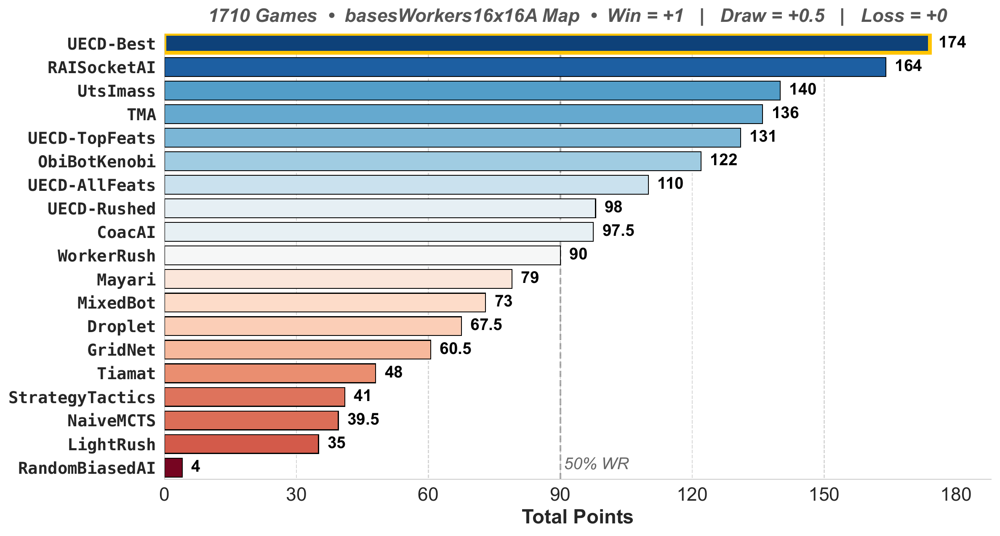

  <figcaption>Final standings across all opponents.</figcaption>
</figure>
<figure>
  
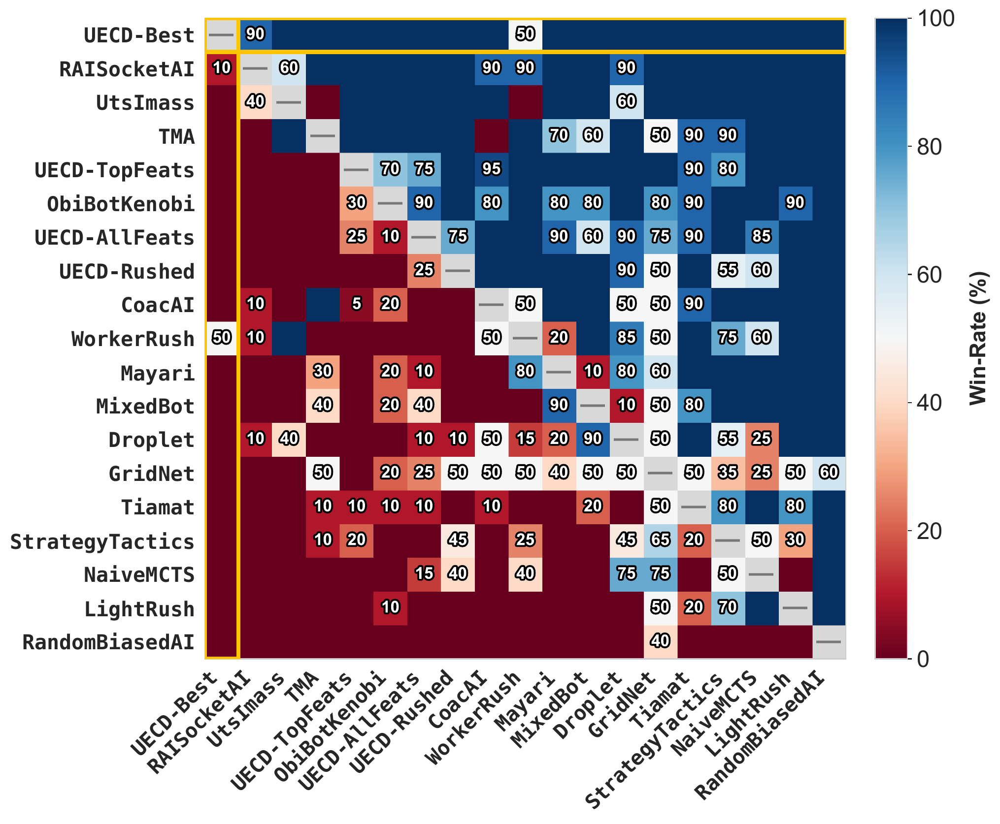

  <figcaption>Head-to-head win-rate matrix.</figcaption>
</figure>

<h2 id="example-games">Example games</h2>

Recordings below show our single-map agent (`BestRL-350M`) playing one game per starting position against each opponent of the tournament, on the `basesWorkers16x16A` map. All games are played with **deterministic actions** (argmax over the policy), matching the tournament protocol. **Left column**: our agent starts in position P0 (top-left corner). **Right column**: our agent starts in position P1 (bottom-right corner). Opponents are listed in the tournament order of strength.

<h3 id="vs-raisocketai">vs RAISocketAI <a href="https://github.com/sgoodfriend/rl-algo-impls" class="ref-link" target="_blank" rel="noopener">source ↗</a></h3>

<figure><figcaption>Our agent plays in P0 positionWin</figcaption></figure>
<figure><figcaption>Our agent plays in P1 positionWin</figcaption></figure>

<h3 id="vs-utsimass">vs UtsImass <a href="https://github.com/narsue/UTS_Imass" class="ref-link" target="_blank" rel="noopener">source ↗</a></h3>

<figure><figcaption>Our agent plays in P0 positionWin</figcaption></figure>
<figure><figcaption>Our agent plays in P1 positionWin</figcaption></figure>

<h3 id="vs-tma">vs TMA <a href="https://github.com/MazzaAlessandro/TMA" class="ref-link" target="_blank" rel="noopener">source ↗</a></h3>

<figure><figcaption>Our agent plays in P0 positionWin</figcaption></figure>
<figure><figcaption>Our agent plays in P1 positionWin</figcaption></figure>

<h3 id="vs-topfeatsrl-100m">vs TopFeatsRL-100M <a href="https://github.com/mathisdelsart/MasterThesis" class="ref-link" target="_blank" rel="noopener">source ↗</a></h3>

<figure>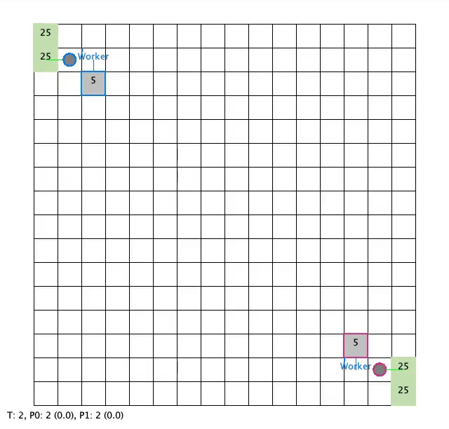<figcaption>Our agent plays in P0 positionWin</figcaption></figure>
<figure>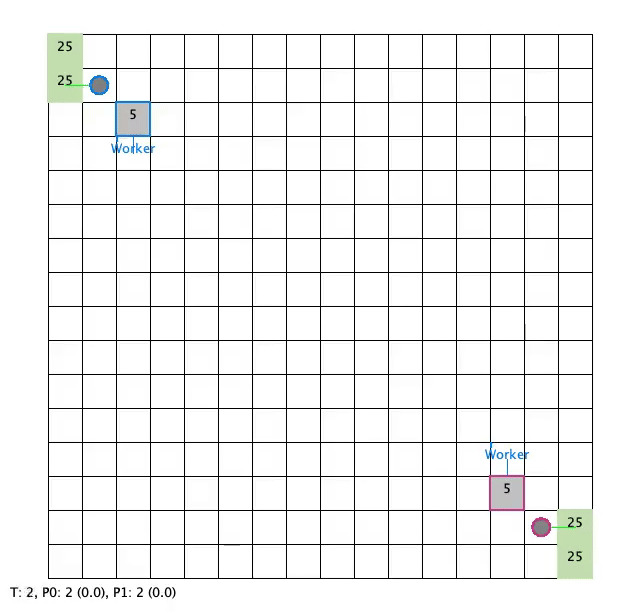<figcaption>Our agent plays in P1 positionWin</figcaption></figure>

<h3 id="vs-obibotkenobi">vs ObiBotKenobi <a href="https://github.com/Jannis42/MicroRTSObiBotKenobi" class="ref-link" target="_blank" rel="noopener">source ↗</a></h3>

<figure><figcaption>Our agent plays in P0 positionWin</figcaption></figure>
<figure><figcaption>Our agent plays in P1 positionWin</figcaption></figure>

<h3 id="vs-allfeatsrl-100m">vs AllFeatsRL-100M <a href="https://github.com/mathisdelsart/MasterThesis" class="ref-link" target="_blank" rel="noopener">source ↗</a></h3>

<figure><figcaption>Our agent plays in P0 positionWin</figcaption></figure>
<figure><figcaption>Our agent plays in P1 positionWin</figcaption></figure>

<h3 id="vs-phasedrl-300m">vs PhasedRL-300M <a href="https://github.com/mathisdelsart/MasterThesis" class="ref-link" target="_blank" rel="noopener">source ↗</a></h3>

<figure>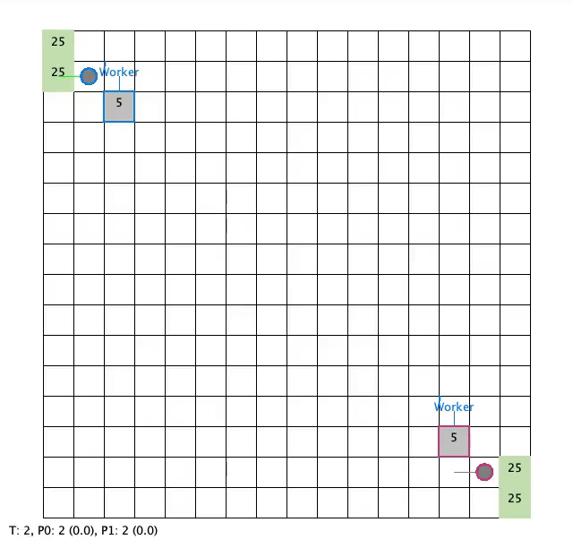<figcaption>Our agent plays in P0 positionWin</figcaption></figure>
<figure><figcaption>Our agent plays in P1 positionWin</figcaption></figure>

<h3 id="vs-coacai">vs CoacAI <a href="https://github.com/Coac/coac-ai-microrts" class="ref-link" target="_blank" rel="noopener">source ↗</a></h3>

<figure><figcaption>Our agent plays in P0 positionWin</figcaption></figure>
<figure><figcaption>Our agent plays in P1 positionWin</figcaption></figure>

<h3 id="vs-poworkerrush">vs POWorkerRush <a href="https://github.com/Farama-Foundation/MicroRTS/blob/master/src/ai/abstraction/partialobservability/POWorkerRush.java" class="ref-link" target="_blank" rel="noopener">source ↗</a></h3>

<figure><figcaption>Our agent plays in P0 positionLoss</figcaption></figure>
<figure><figcaption>Our agent plays in P1 positionWin</figcaption></figure>

<h3 id="vs-mayari">vs Mayari <a href="https://github.com/barvazkrav/mayariBot" class="ref-link" target="_blank" rel="noopener">source ↗</a></h3>

<figure><figcaption>Our agent plays in P0 positionWin</figcaption></figure>
<figure><figcaption>Our agent plays in P1 positionWin</figcaption></figure>

<h3 id="vs-mixedbot">vs MixedBot <a href="https://github.com/AmoyZhp/MixedBotmRTS" class="ref-link" target="_blank" rel="noopener">source ↗</a></h3>

<figure>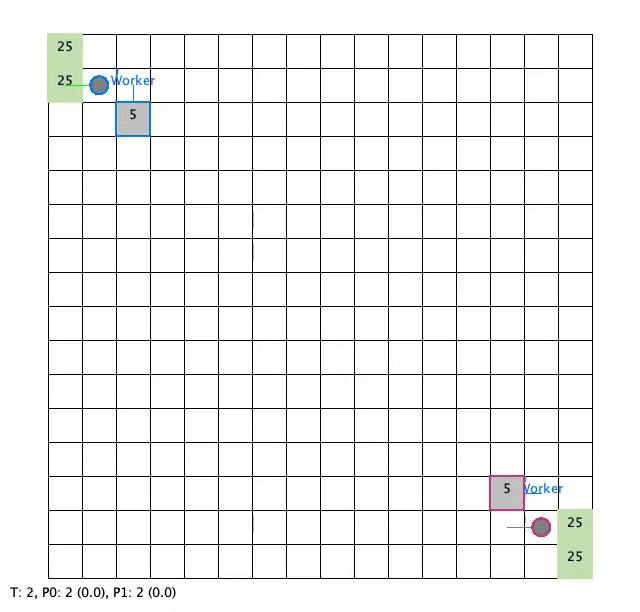<figcaption>Our agent plays in P0 positionWin</figcaption></figure>
<figure>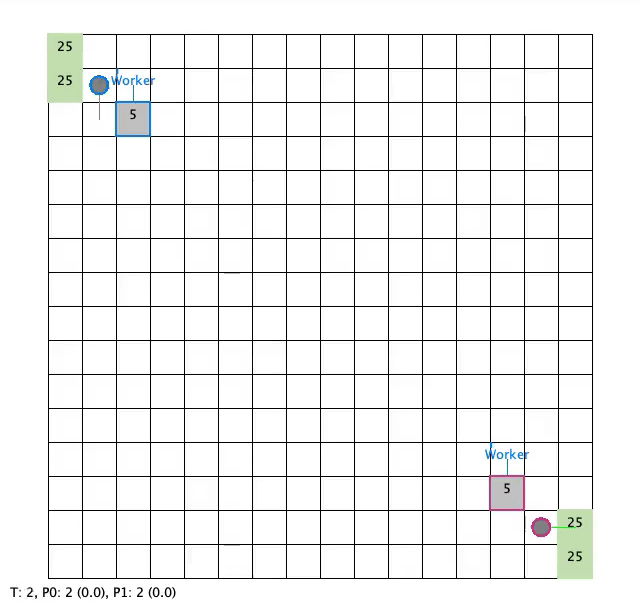<figcaption>Our agent plays in P1 positionWin</figcaption></figure>

<h3 id="vs-droplet">vs Droplet <a href="https://github.com/zuozhiyang/Droplet" class="ref-link" target="_blank" rel="noopener">source ↗</a></h3>

<figure><figcaption>Our agent plays in P0 positionWin</figcaption></figure>
<figure><figcaption>Our agent plays in P1 positionWin</figcaption></figure>

<h3 id="vs-gridnet-300m">vs GridNet-300M <a href="https://github.com/Farama-Foundation/MicroRTS-Py" class="ref-link" target="_blank" rel="noopener">source ↗</a></h3>

<figure><figcaption>Our agent plays in P0 positionWin</figcaption></figure>
<figure>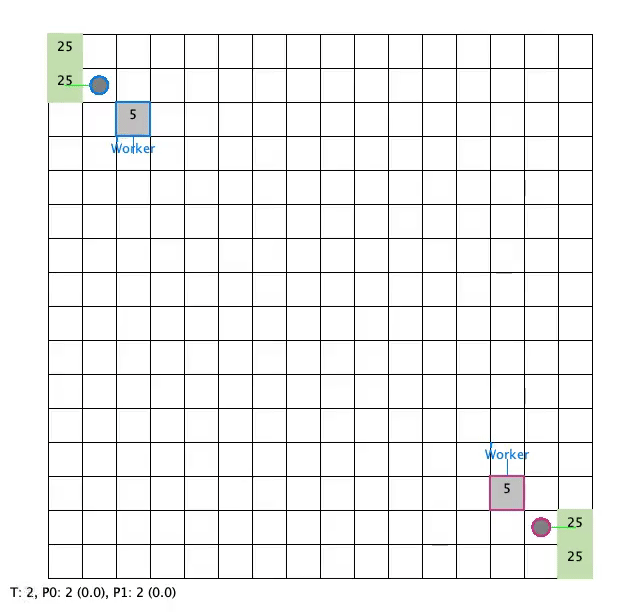<figcaption>Our agent plays in P1 positionWin</figcaption></figure>

<h3 id="vs-tiamat">vs Tiamat <a href="https://github.com/jr9Hernandez/TiamatBot" class="ref-link" target="_blank" rel="noopener">source ↗</a></h3>

<figure><figcaption>Our agent plays in P0 positionWin</figcaption></figure>
<figure>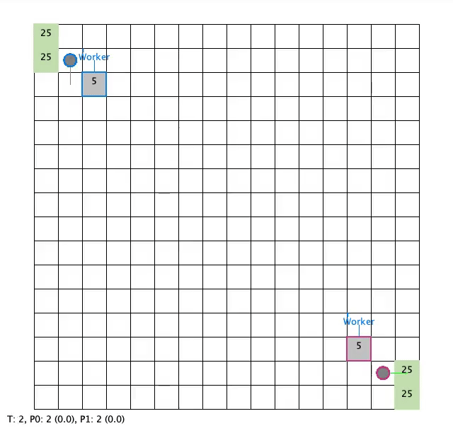<figcaption>Our agent plays in P1 positionWin</figcaption></figure>

<h3 id="vs-strategytactics">vs StrategyTactics <a href="https://github.com/nbarriga/microRTSbot" class="ref-link" target="_blank" rel="noopener">source ↗</a></h3>

<figure><figcaption>Our agent plays in P0 positionWin</figcaption></figure>
<figure><figcaption>Our agent plays in P1 positionWin</figcaption></figure>

<h3 id="vs-naivemcts">vs NaiveMCTS <a href="https://github.com/Farama-Foundation/MicroRTS/blob/master/src/ai/mcts/naivemcts/NaiveMCTS.java" class="ref-link" target="_blank" rel="noopener">source ↗</a></h3>

<figure><figcaption>Our agent plays in P0 positionWin</figcaption></figure>
<figure>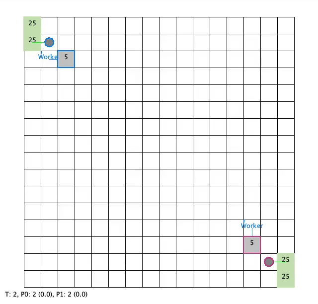<figcaption>Our agent plays in P1 positionWin</figcaption></figure>

<h3 id="vs-polightrush">vs POLightRush <a href="https://github.com/Farama-Foundation/MicroRTS/blob/master/src/ai/abstraction/partialobservability/POLightRush.java" class="ref-link" target="_blank" rel="noopener">source ↗</a></h3>

<figure><figcaption>Our agent plays in P0 positionWin</figcaption></figure>
<figure>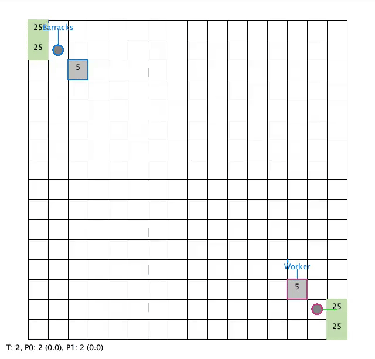<figcaption>Our agent plays in P1 positionWin</figcaption></figure>

<h3 id="vs-randombiasedai">vs RandomBiasedAI <a href="https://github.com/Farama-Foundation/MicroRTS/blob/master/src/ai/RandomBiasedAI.java" class="ref-link" target="_blank" rel="noopener">source ↗</a></h3>

<figure><figcaption>Our agent plays in P0 positionWin</figcaption></figure>
<figure><figcaption>Our agent plays in P1 positionWin</figcaption></figure>

<h2 id="detailed-tournament-analysis">Detailed tournament analysis</h2>

Game-theoretic metrics behind the final standings. These complement the head-to-head matrix shown at the top of the page.

<figure>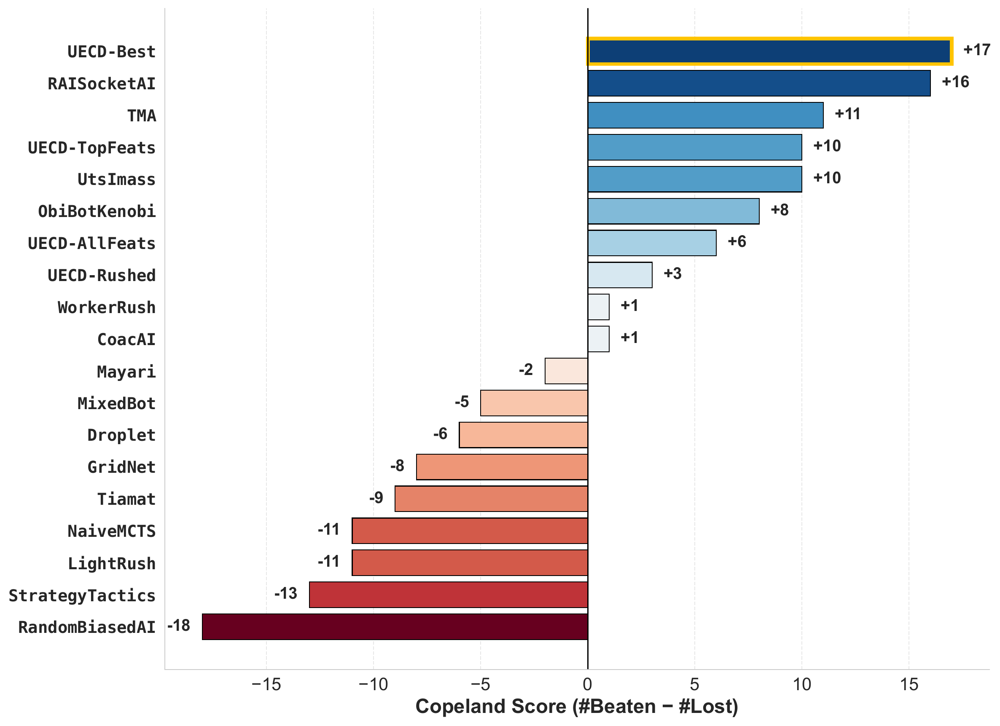<figcaption>Copeland scores.</figcaption></figure>

<figure>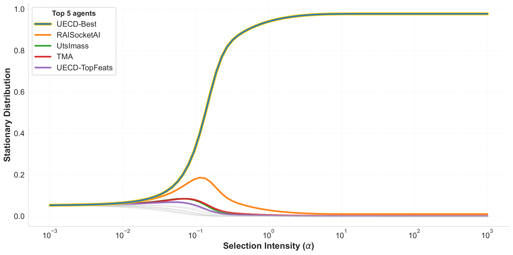<figcaption>Alpha-Rank sweep.</figcaption></figure>

<figure>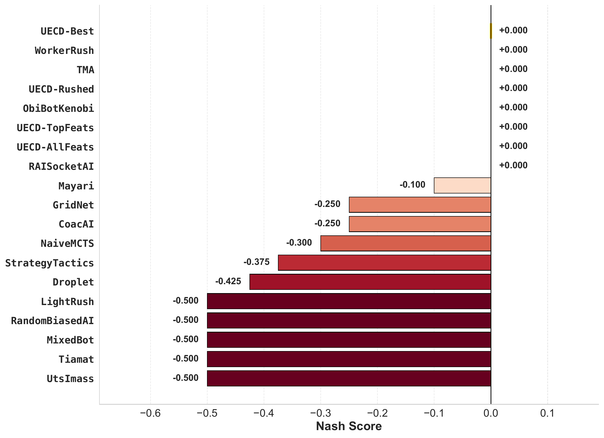<figcaption>Nash averaging scores.</figcaption></figure>

<figure>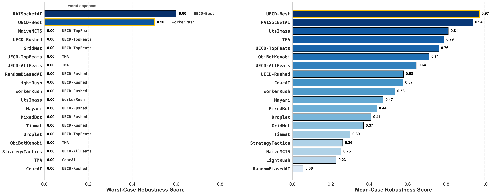<figcaption>Robustness across opponents.</figcaption></figure>

